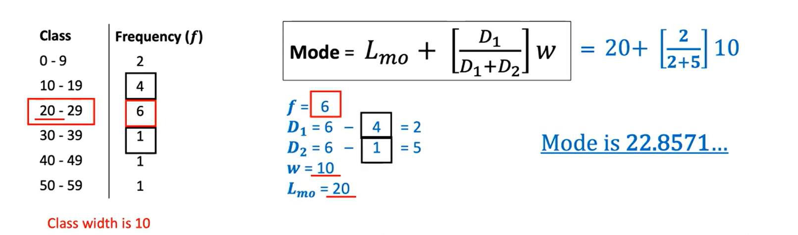

# Data Exploration
| Data  | Information  | Knowledge  |
| ------------- |:-------------:| -----:|
| Fragmented   | Refined    | Useful |
| Unstructured | Structured | explanatory |
| Lots         | some       | one |

## Central Tendencies
* Mean: 
    * Average of the data `sum(data)/len(data)`.
    * Uses all parts of the data set. 
    * Affected the most by outliers.
    * Result may not be part of the data set.
* Median: 
    * Middle of the data points `sorted_data[len(sorted_data)/2]`
    * Less susceptical to outliers.
    * Better measure of central tendency when there are extreme values.
* Mode: 
    * Most common data, eg in ` 5 in [4,2,5,5,5]`, can have more than 1 mode.
    * Able to report multiple modes.

## Mode of Grouped Data

* Create groups/ classes within the data.
* `Mode` = l_mo + (d1/d1+d2)*w
* `l_mo` is the lower boundary of the modal class eg the class with highest frequency
* `d1` is the difference between the frequency of the modal class and the class previous to it
* `d2` is the difference between the frequency of the modal class and the class after it.
* `w` is the width of the classes

## Measures of Spread
* Range: Difference between min and max of dataset.
* Quartiles: segment the distribution into 4 parts of equal size.
* Inter Quartile Range: Difference between value at 75% and 25% of values.
