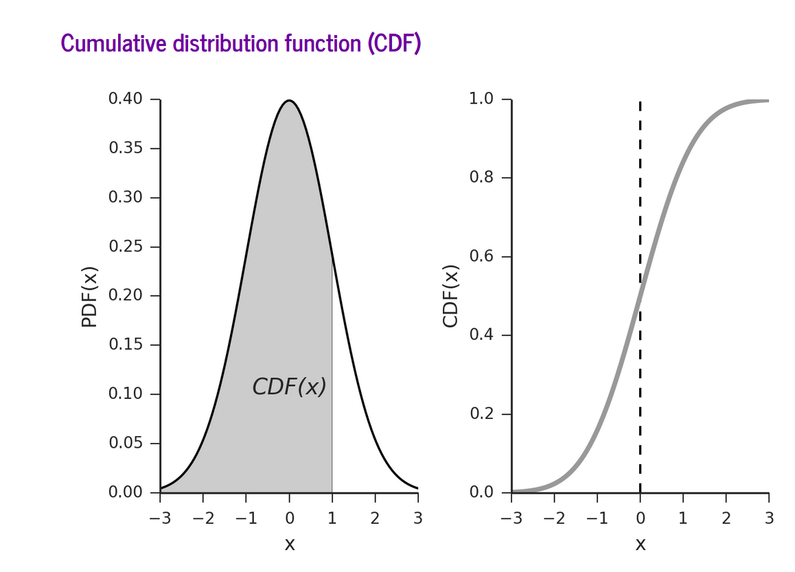

# Statistics 1

## Hypothesis testing
* A hypothesis is an either true or false statement.
* We can use statistics to judge the probability that a hypothesis is True or False.
* We need to decide when the probability is high enough for the hypothesis to be True.

## Null Hypothesis
* There is no difference in the datasets. 
* Differences are due to chance 
* Probability that it is true is the `p value`.
* if `p value` < `alpha` then accept the `alternative hypothesis`.
* Otherwise it cannot be rejected.

## Critical values
* Value of the distribution where the mass of the tail equals `alpha` exactly.
* For a 2 tail test, the tails must add up to the alpha.

## CDF vs PDF

* Probability Density function is the probability of a range of values.
* Cumulative Density function is the intergral of the PDF.
* Eg for the PDF on the left, given the CDF on the right, a value of x< 0 is 0.52 due to the intersection in the y axis with the graph.

## Calculating if a null hypotheis can be rejected (Binomial)
* Consider a coin flipped 100 times with 41 heads, is it abnormal? 
* The lower tail critical value is 40 and the upper tail is 60 due to the ppf at the 5% interval.
* The two tailed p value for 41 is 0.0222 via the intersection with the CDF.
* The lower tail p value is double of this.
* Since the lower half of the 2 tails is 0.025 and the p value is 0.044, the null hypothesis cannot be ruled out.