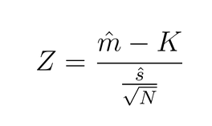

# Z Test

* Null hypothesis is a normal distribution.
* Is normalised to give the Z value and then compared with the critical value (given).
* Z is the value of the test
* m is the empirical mean
* K is the value being compared to
* s is the empirical standard deviation
* N is the number of datapoints
* To note is that the denominator is just the SEM.

## Test Example
```python
students = 200
usual_average = 0.68
average_tested = 0.65 #Checking if this is normal
usual_standard_deviation = 0.15
critical_value = 0.05

SEM = usual_standard_deviation/sqrt(students)
z_statistic = (usual_average - average_tested)/SEM

critical_value_calculated = get_critical_value(critical_value) # Uses a given function

if z_statistic > critical_value_calculated:
    print("Reject Null Hypothesis")
else:
    print("Do not reject null hypothesis")
```

# T Test
* The same as Z test except for smaller values of `N`.
* Used when `N` is less than 30.
* Takes additional parameter, `degrees of freedom` which is `n-1`.

# Simulations
* Run a program many times to get a result.
* The p-value is the amount of times a result has been within the constraints of the hypothesis divided by the number of results.
* This can be used to check if a null hypothesis can be rejected.
* Does not require an underlying distribution

# Bootstrapping
* Can be done without knowing the underlying distribution.
* Using the existing datapoints to get a distribution.
* Biases from underlying will be seen in the new datasets.

## How to bootstrap
* Create a new empty dataset and randomly pick add values to it from the existing dataset n times where n is the number of elements in the existing dataset. 
* Elements can be chosen more than once.
* Get the statistic desired of the new dataset and add that to the final dataset.
* Repeat this many times to flesh out the final dataset.
* Check if the originally desired result is within the acceptable alpha value of the final data set.

## Calculating p value from dataset
* Trying to check if the mean of a dataset is an anomaly. 
* Get the mean of the existing dataset
* Offset the values in the existing dataset by the mean. 
* Do bootstrapping using the mean of the newly bootstrapped datasets. 
* The final dataset should be a dataset of all the shifted means. 
* If the original mean is outside the range of alpha values from the center of the new set, then the null hypothesis can be rejected.

