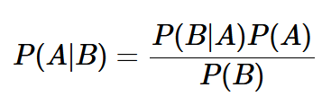

# Bayesian Reasoning

* Probability of A given B.
* Probability of A and B if they are independant is `P(A) * P(B)`.

## Bayesian Parameter Estimation
* Consider that a coin is flipped 100 times (N) and it is heads 41 times (n), what is the probability of the coin tossing heads? (theta)
* Thus P(theta | n and N) = (P((n and N) | theta)*P(theta))/P(n and N)
* Consider P(n and N) = P(x1| theta) * p(x2| theta) * ...
* Thus when x1 is heads, x1 is theta and when it is not, it is 1-theta, thus
* P(n and N| theta) = theta^n * (1-theta)^(N-n)
* Thus P(theta | n and N) = (theta^n * (1-theta)^(N-n)*P(theta))/P(n and N)
* We can allow P(theta) to be 1 as we are using a uniform prior.
* For P(n and N), we need to intergrate `theta^n * (1-theta)^(N-n)`. This is not always possible so we can just leave it as 1. 
* Thus P(theta | n and N) = (theta^n * (1-theta)^(N-n)