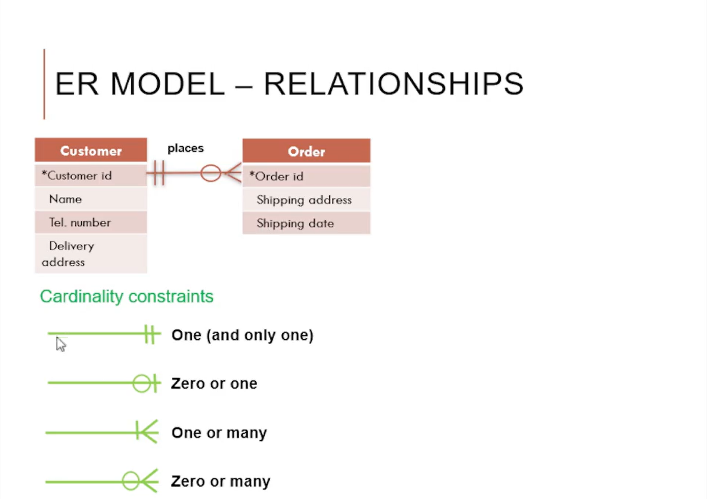

# Entity Relationship Modeling 

* Entity Relationship Modelling is used to model relational data.
* Entities are unique 'things' that can have attributes (data) and relationships that connect multiple entities.

