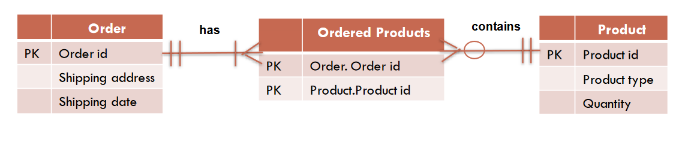

# Placement of Foreign Keys

* Since foreign keys are the same in both the parent and child tables, the decision for where the foreign key should be placed is based on the type of relation.

## One to One
* The foreign key can be placed on either table.

## One to Many
* If there is a relation of one parent to many children, the foreign key should be in the children so they can each point to the parent.

## Many to Many
* If One parent can have many children and each children can have many parents, a new table is needed to store these relations.
* The table will store the relations of `Primary Keys` to both tables.

