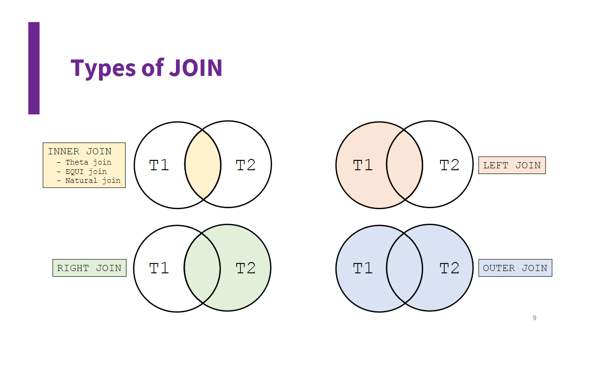

# SQL

## SELECT

Used to query the data and get specific existing data.

```sql
SELECT `Property_1`, `Property_2` FROM `table_name` WHERE `property` < some_val;
```

## ALTER TABLE

Used to modify the table itself

```sql 
ALTER TABLE `table_name` CHANGE `property` `column_affected` new_property;
```

## UNION SELECT

Includes all tuples that are in either table and eliminates duplicates.

```sql
SELECT `property_name` FROM `table_1` UNION SELECT `property_name_2` FROM `table_2`;
```

# Joins


Joins are used to combine the results from 2 tables. There are different types of joins as shown for what kind of data needs to be shown after being merged.

```sql
--Theta join, shows all pairs of characters and player where the character's acceleration is more than the player's rating. 
SELECT * FROM `Character`, `Player` WHERE Character.acceleration > Player.rating 

--Left join, shows all pairs, however all rows from the first table must appear, if there is no valid pair for that row, the values are filled with nulls
SELECT * FROM `Character` LEFT JOIN `Player` WHERE Character.acceleration > Player.rating 
```