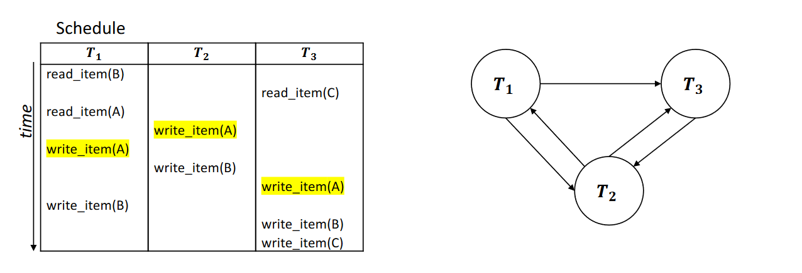

# Transaction Scheduling

* When executing transactions concurrently in an interleaved fashion, schedules need to be created.
* For any pair of operations from the same transaction, their relative order must be preserved in the schedule.
* For any 2 conflicting operations, one must occur before the other in the schedule.

## Serialized Transactions
* Schedules are serial if one transaction completes before another begins.
* However, this is slow hence a method to make a `serialized schedule` must be made that is equivalent to some serial schedule of the same transactions.
* Two schedules are equivalent if the operations applied to each data item affected
by the schedules should be applied to that item in both schedules in the same
order.

## Serializing Schedules
* Create a node for each transaction.
* For each item in the transaction, go down the list of items in all transactions.
* Draw an arrow from one node to another if all 3 criteria are met:
    * The items are in different transactions.
    * The items access the same data item.
    * Both or one are write operations
* If a `cycle` gets created, then the schedule is not `conflict equivalent` to the `serialized schedule` and is thus invalid.

