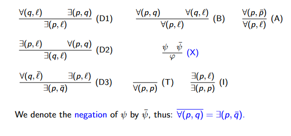

# Search

Some inferential tasks can be thought of as graph searching problems with the following implementation:

## Defining Requirements

The problem has to be represented with the following `schemata`:
* `Fluents`: Facts that we have certainty of.
* `Permanents`: Fluents that are constant.
* `Goals`: Fluents that need to come true
* `Actions`: A list of `Fluent` pre-conditions as well as a list of `Fluent` post-conditions that become either True or False if the action is taken.

## Using the Requirements

Thus a directed graph can be made where the nodes are the situations containing the `fluents` and they are linked by `actions` which lead to other situations. 

This graph can be searched by a searching algorithm to find a situation where the `goals` are all met. The tree can be kept finite by ignoring vertices that lead to previously encountered situations

# Solving Logical Arguments

Using a formal set of logic, inference rules along with a list of `syllogistics` can be used to prove arguments in another form of the `syllogistic`

## Syllogistics

Syllogistics are statements of the form:

| Symbol                 | Meaning           |
| ---------------------- | ----------------- |
| $\forall$(p, q)        | Every p is a q    |
| $\forall$(p,$\neg$ q)  | no p is a q       |
| $\exists$(p, q)        | Some p is a q     |
| $\exists$(p, $\neg$ q) | Some p is not a q |

## Syllogistic inference rules

The rules can be applied to derive new syllogistics from old ones. The top 2 rules are the pre-conditions and the bottom is the result.

* `l` refers to any expression q or $\neg$ q
* For rule X, if a premises is true and untrue at the same time, then anything can be proven to be true.
* Solving syllogistics like this can be done via a search where the nodes are knowledge states and the edges are applications of an inference rule.

