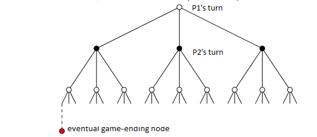

# Adversarial Search

[Video from MIT explaining this entire topic](https://www.youtube.com/watch?v=STjW3eH0Cik)

## Game State Representation

* Games can be modeled as graphs where the nodes represent the player who is playing and vertices represent the possible moves that the player can make.
* Assuming that we are viewing the problem from the perspective of `P1`, the leaf nodes of the graphs represent the results of the game. The node is given a value of `infinity` if the player wins at that move, 0 if it is a `draw` and `negative infinity` if the player loses.
* For games with too many possible moves to calculate the final leaf nodes, a specified `maximum depth` can be used where the tree stops and evaluates the game state using a game-specific `static evaluation` function that returns a numerical score for the board.



## MiniMax

* `P1` would want to maximize the score while `P2` would like to minimize the score.
* Hence, starting at the leaf nodes, if it's parent is a `maximizing node`, the parent takes the higher of the children and vice versa. A node is a `maximizing node` if it is `P1`s turn.
* This propagates up the tree and hence if `P1` wants to win, they would choose the nodes with the highest score at every turn to win the game. The opposite is true for `P2`.

### Node evaluation function
```python
def evaluate_node(node):
    if node.children is None:
        return node.val
    elif node.maximizing:
        return max([evaluate_node(child) for child in node.children])
    else:
        return min([evaluate_node(child) for child in node.children])
```

### Node evaluation function with max depth
This evaluates the node's value with a maximum value if the tree is too large to search exhaustively
```python
def evaluate_node_max_depth(node, depth):
    if depth == 0:
        return static_eval(node)
    elif node.maximizing:
        return max([evaluate_node_max_depth(child, depth-1) for child in node.children])
    else:
        return min([evaluate_node_max_depth(child, depth-1) for child in node.children])
```

## Alpha Beta Pruning
The `MiniMax` algorithm is not efficient as the time complexity scales with `b^d`. Alpha Beta pruning can bring it down to `2b^(d/2)` where `b` is the branches per node and `d` is the depth.

This uses a looking ahead technique where a maximizing node analyses the minimums that a minimizing node will take after selecting each of the branches that the maximizing node can select. If there is a node on a branch that is lower than the current highest that the minimizer can take, that branch is ignored and is not analyzed.

* At a maximizing node, `B` comes from the parent and `a` is the value of the highest child so far.
* At a minimizing node, `a` comes from the parent and `B` is the value of the lowest child so far.
* A node stops being processed when `a` >= `B`.

```python
def abprune(node, depth, a, b):
    if depth == 0:
        return node.val
    elif node.maximizing:
        a = float('-inf')
        for child in node.children:
            a = max(a, abprune(child, depth-1, a, b))
            if a >= b:
                return a
        return a
    else:
        b = float('inf')
        for child in node.children:
            b = min(b, abprune(child, depth-1, a, b))
            if a >= b:
                return b
        return b
```