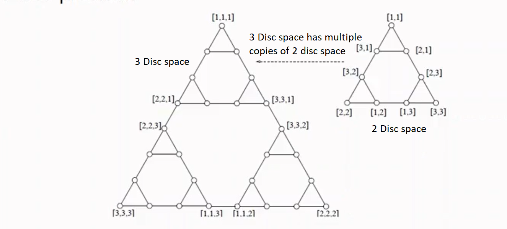

# Search Shortcomings

Using a search algorithm for games is not always the most optimal way to solve games. This is shown with `the towers of hanoi`

## Rules of the game

* The goal is to move all discs from tower 1 to tower 3.
* One disc can be moved at a time.
* A larger disc cannot be placed on top of a smaller disc.
* There are 3 towers.

## Representing the game

* Each state can be represented with an array where the tower that the first disc is on is in the first index, the tower that the second disc is on is in the second index etc.
* [3,3,1], Disc 1 and disc 2 are on tower 3, disc 3 is on tower 1

## The game state relations

* The 3 disc space is made of 2 disc spaces. 
* This is an undirected graph as moves are reversible.

## Why is using search inefficient

* Given the diagram, the answer to towers of hanoi is to use the straight line path from one of the triangles to another. 
* Using a search would needlessly use computation to find less viable states.