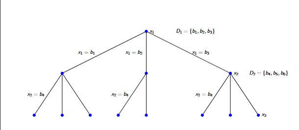

# Constraint Satisfaction

* A constraint satisfaction problem can be represented with 3 components:
    * `X` - A set of variables.
    * `D` - A set of domains with values that the variables in `X` can take.
    * `C` - Constraints that set limits on the combination of values that variables in X can take. Eg X1 cannot be 1 if X2 is 3.
* The aim is to set a value for each of X where their values are within the domains and do not violate any constraints.

## Solving Constraint Satisfaction Problems with Search

* Constraint satisfaction problems can be represented as a tree with the nodes as variables and the edges representing values that are given to each variable.
* Going down the tree, a new variable is set each time that leads to a valid state based on the domains and the constraints that hold given previous variables that were set.
* Hence the graph is not full, if X1 has been set to b2, there will not be a branch from that node wherein X2 is b6 as that is an invalid state when there is a constraint where x1 = b2 and x2 = b6 cannot hold true. (shown above)
* The problem is solved at nodes wherein the depth of the tree is the number of variables in X.
* Hence a depth first search with backtracking can be used to find solutions to the problem.

## Speeding up Search with Heuristics

### Minimium Remaining Value Variable
* Search can be sped up if the variable to be set chosen at each stage is the variable with the least available values that it can choose.
* This leads to a higher likelihood of failure before completing the CSP hence leads to faster pruning.

### Least Constraining Value
* Search can be sped up if the value given to the variable maximises the amount of values that neighbouring variables can take in future steps.
* This speeds up search as only one solution is required hence this maximises the chances of finding a solution faster.