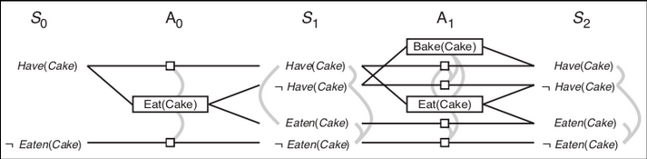

# Planning Graphs

* Planning graphs are used to give better heuristics when solving planning problems.
* They only work for `propositional planning` problems (problems without variables).
* They cannot give a definitive answer if the goal can be reached by the initial state but can give an estimate for how long it will take to reach the goal.
* It never over estimates.

## Planning Graph Representation

* The planning graph has alternating levels for states and actions.
* Each state level contains every possible state at that depth.
* Each action level contains every possible action that can be taken by each state and the states that they then lead to.

## TODO Add mutex links 