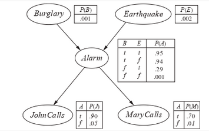

# Bayesian Networks

* Bayesian networks are used to model situations with probabilities.
* Consider the definition of a "situation" in this context:
    * Variables can take a value of True or False.
    * Each variable has a probability when it is True, 1-probability when it is False.
    * A situation is a combination of variables and their values eg "raining" is True but "flooding" is false
* Storing the probability of each situation is computationally redundant in the cases where variables have dependencies and are not all independant.

| Raining | Flooding | Probability |
|---------|----------|-------------|
| True    | True     | 0.05        |
| True    | False    | 0.3         |
| False   | True     | 0.01        |
| False   | False    | 0.64        |

> Example of modelling situations using a table without dependencies

* Hence, to prevent having to store `2^n` rows where n is the number of variables, we can use bayesian networks to model the relationships.

## Defining Bayesian Networks

* Bayesian networks are modelled using directed acyclic graphs.
* Relationships show that the child node is conditionally dependant on its parents. 
* Each node has a conditional probability distribution (conditioning) that quantifies the effects of the parents on the node. (eg there are 4 entries if it has 2 parents, 2 entries if it has 1 parent, 1 entry if it has no parents)

## Inference from Bayesian Networks

### TODO make sense of Inference 