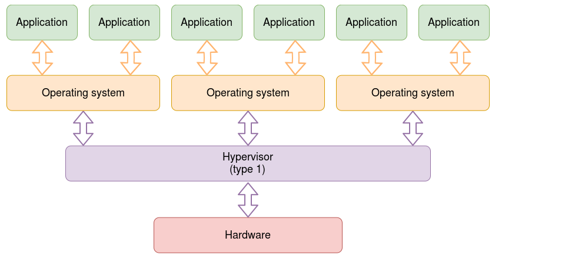
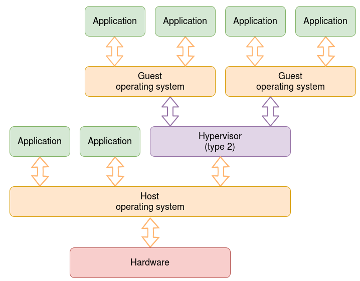

# Virtualisation

## Virtualisation
* Creating an ideal virtual interface for a specific resource to act as an interface between the user and the underlying resources so the resources can be shared adequately
* Virtual memory, time sharing etc
* Can be expanded to the concept of networks wherein networks are split up to allow for specified access. 
* Can be expanded to the concept of networks wherein data can be nested in a protocol such that data of a protocol can be sent within that of another protocol.

## Hypervisors
* A virtualisation layer for the operating system that sits between the OS and the underlying hardware.

### Type 1 Hypervisor

* Sits between the hardware and the multiple operating systems.
* Allows for some direct communication between the OS and the hardware, leading to higher performance. 
* Requires hardware support.
* Used mostly in cloud/ server applications

### Type 2 Hypervisor

* Runs on a host operating system. 
* Requires less hardware support but more software support as there is more need to intercept hardware calls.
* Lower performance as it is a software emulation.

# Malware Analysis

## Static Analysis
* Examining file metadata.
* Checking hash validity.
* Can be used to check which DLLs the executable is importing to understand the underlying OS calls that it uses eg network access and checking if it is running in a debugger.
* Not all DLL imports can be seen using static analysis as the program can import additional DLLS during runtime.
* Checking embedded resources like strings stored within the application

## Behavioural Analysis 
* Letting the malware run in a safe environment.
* Usually tools are enabled to see what OS calls/ network access the executable is trying to make.

## Code Analysis
* Analyse the code (usually assembly) in a debugger to see what the executable is doing.
* Can be used to step over code or change the results of OS calls to check the specific pathways that the code can take.