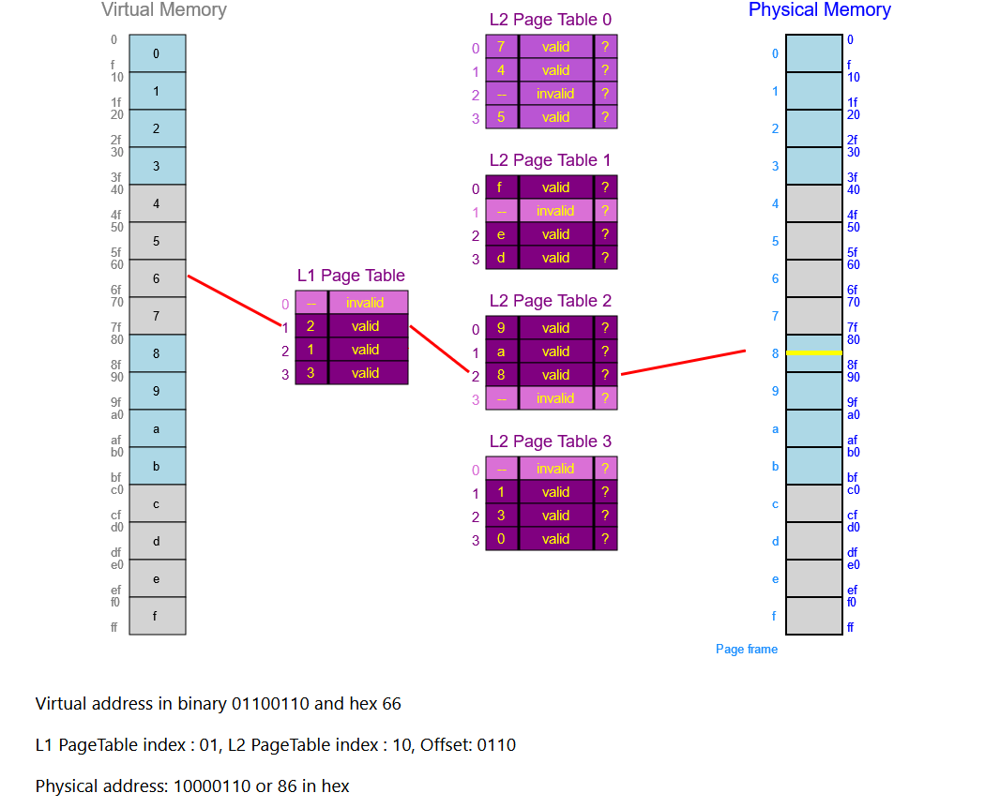
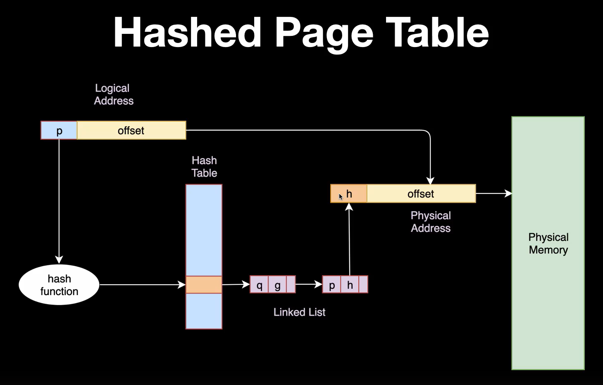
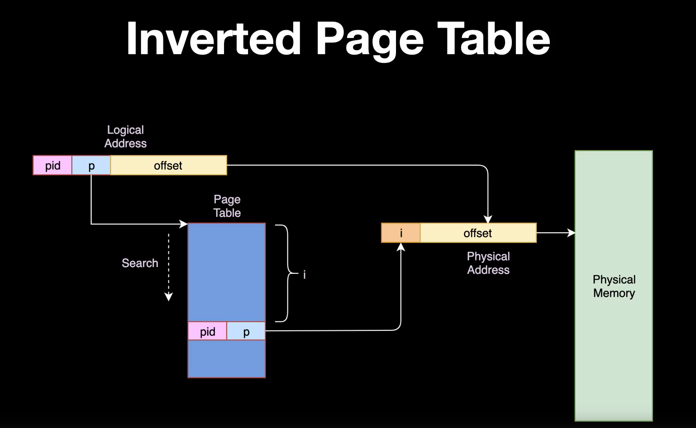

# More Memory
## Memory Mapping 
* Programs will be given virtual addresses that need to be translated into physical addresses: 
    * To ensure that 2 programs can use the same virtual addresses simultaneously.
    * To prevent processes from reading the memory of other processes.
    * Not all memory needs to be mapped to a physical address.
* Thus page tables are used to convert virtual addresses to physical addresses. 

## Page tables 
* Addresses are organised into pages of a fixed size `(2^5 bytes)`.
* The most significant bits of an address are used for the page table address `(page table offset)`.
* The `page table offset` is the offset from the start of the `page table`.
* The rest of the bits are the `page offset`.
* The MMU contains a fixed register which tells the CPU the address of the `page table`.
* Using `page table offset` + `page table address`, the address of the `page base` can be found.
* The `page base` points to the physical address of the page that is requested.
* The CPU checks to see if the process has the right permissions to access that `page`.
* The `page physical address` + `page offset` is the physical location of the virtual memory address. 
* The mapping is usually done on a hardware `Memory Mapping Unit`

## Multi-Level Page Tables.

* For a `32bit` architecture with a page size of `4KiB`, 12 bits are required for the offset, hence 20 bits are left for the page address. 
* This requires 2^20 entries in the page table. This wastes a lot of memory since it is unlikely that processes will need memory spread throughout all the page tables. 
* Hence multi-level page tables are used.
* The first `x` bits are used for the first level page table, the second `x` bits are used for the second level page table. The amount of bits per table and the amount of tables can vary based on the architecture.
* The page table is unlikely to be fully expanded thus there are significant memory savings.
* The `level 1 table base` + `first index` can be used to get the location of the `level 2 table base`. 
* The `level 2 table base` + `second index` will be used to get the `page base` of the physical address. 
* This can be used to get the physical memory location.

# Hashed Page Table
* Hashing functions deterministically convert a larger space of possibilities to a smaller space that is fully utilised (surjective).
* This can be useful as even with hierarichal page tables, there can be too many first level page tables.
* Thus the virtual offset can be used as an input to a hash function to get the address of the physical page. 
* However, because a larger space is being converted to a smaller space, there can be `hash collisions` where 2 inputs have the same output.
* Hence on the output side, there should be a linked list wherein all the items that map to that particular hashed output are part of that linked list.
* The list can then be looked through to find the value that was being searched for.

* Thus the process is as such:
    * The `page table offset` (MSB) are passed through a hashing function. 
    * The output of the hashing function gives a location in the `hash table`.
    * All the corresponding entries in the `linked list` of `MSBs` and their corresponding `physical page addresses` at the corresponding location on the `hash table` are looped through to find the right address.
    * This gives the `physical page address` and the `physical address` can be calculated using it and the `page offset`.
* Since each linked list does not have a fixed size, the time taken to access memory can become unpredictable.

# Inverted Page Table

* There is only 1 page table
* The virtual memory addresses have their `process id` and `page number` in their address.
* These are used to index into the `page table`. 
* This gives the `physical page address`.
* Because each physical address maps to only 1 virtual address, multiple processes cannot share physical memory locations hence there has to be less total memory utilisation in the system.
