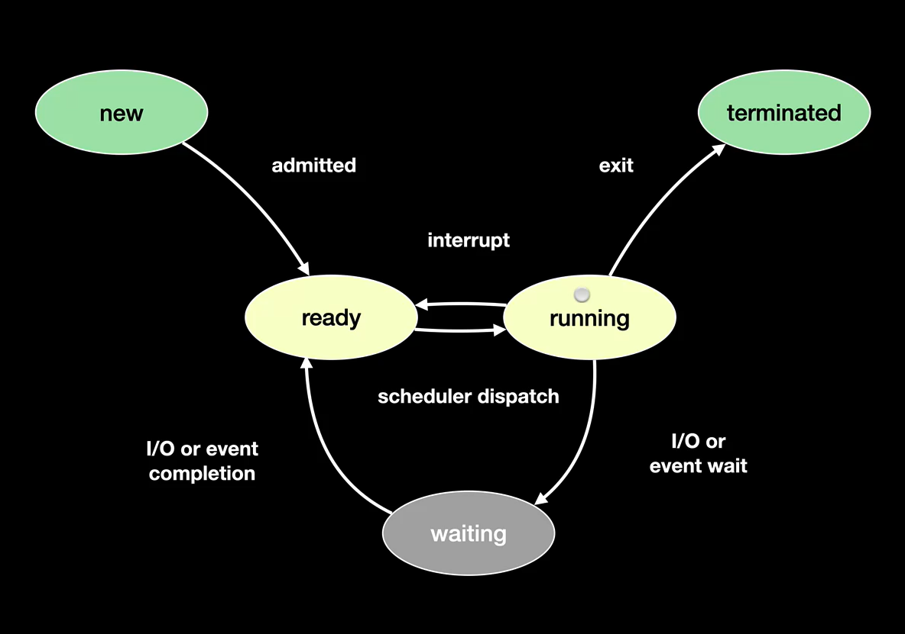

# Processes
* A `process` is a container that holds all the information needed to run a process
    * Memory
    * Registers 
    * Metadata (`PID`)
    * Permissions

## Process states

* When a process is created, it is in the new state. 
* When adequate checks for permissions etc are run, the process is put in the ready state.
* When the CPU has time allocated for the process, it is put in the running state. 
* It can leave the running state when the CPU gets interrupted or is time sliced to run another process.
* When a process has an I/O event or is waiting for another process, it is sent to the waiting state and the CPU will be free to run other processes. 
* The process is then put into the ready state when an interrupt is sent to the CPU to put it back in the ready state.
* The process terminates when it tells the OS to terminate it.

## Batch Processing
* The CPU needs to split it's time up between processes to complete them all.
* First in First Out: The simplest strategy that does not have any CPU overhead. Runs processes in the order they were given in
* Shortest job next: Runs the jobs in ascending order of time. Has the lowest latency however requires some CPU overhead to sort the processes by the amount of time they will take.
* These techniques can further be improved by jumping to other processes when 1 process requires a delay in the form of external input so the CPU does not waste time waiting.