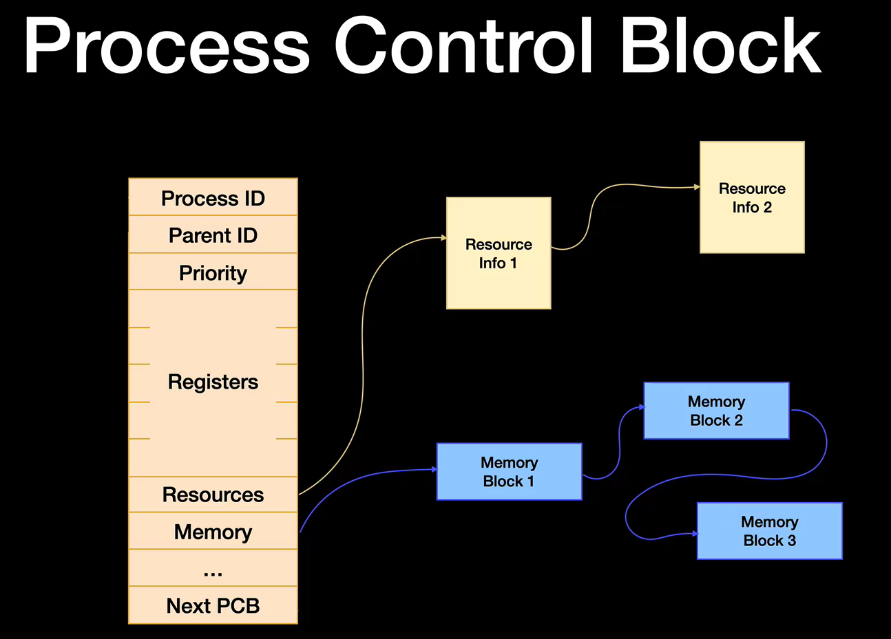

# More Processes

## How Processes start
* The first process is an initialisation process like `initd` or `systemd`.
* These processes are `daemons` which are procesess that run in the background and are not user facing.
* The `init` processes will then use `fork()` to create other processes which will be connected to them as their children.

## Process Lifecycles
* A parent process uses `fork()` to create a `child` process.
* It is expected for the `child` process to terminate before the `parent` process. 
* After the `child` process terminates, the `parent` is able to call the `wait()` function to get the termination status of the `child`.
* This allows the resources used by the child process to be freed. 
* If `wait()` is not called, the child process's resources cannot be freed hence it becomes a `zombie process`.
* If for any reason the `parent` process dies before the `child`, the `child` is `orphaned` and is then inherited by the `init` process.

## Process Control Block

* Stores the context of a process and is in essence the "definition" of the process to the OS.
    * Process ID
    * Parent ID
    * Process Registers
    * Memory (usually in a hierarichal page table)
* Usually stored in a linked list that points to the next process.
* Because the memory is stored in a hierarichal page table, only 1 pointer needs to be changed to switch processes and use the memory of another process.

# Deadlocking
* When two or more processes sharing a resource are actively preventing each other from accessing the resource, resulting in both processes being unable to progress.

## Causes of Deadlock
* Mutual exclusion: A resource can only be used by 1 process at a time.
* Hold and wait: Once a process has a resource it requires, it does not relinquish the resource that it has until it has gathered all the other resources it requires and has completed its computation. 
* No pre-emption: No other process can force other processes to relinquish their resource.
* Circular wait: When one process waits for a resource that is being used by a process that is waiting for a resource being used by the former process. (Can be more than 2 processes)
* If all of these criteria are present, a system is able to deadlock.