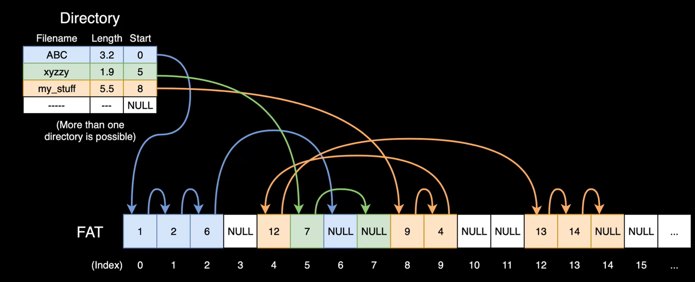
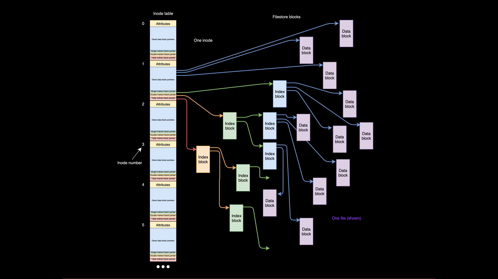

# File Systems I

# File Allocation Table (FAT) File System

* A simplistic form of file allocation that does not require an underlying operating system.
* Contains both a directory and a data section. 
* The data section is broken up into blocks of data of a fixed size.
* The Directory contains info like the filename, the length of a file and the block that it starts on. 
* Blocks are usually small like `4KB` or `1KB` hence the end of the data block points to the address of the next data block in that file.
* The end of the block is NULL if that is the end of that specific file.

## Issues with FAT
* If the files on the filesystem are small, the directory can become full before the data section is full. Thus no more new files can be created.
* This is an issue as the size of the data and directory sections are created when the disk is first formatted.
* The opposite issue occurs if the files are too large however given that the directory is usually small, this is a non-issue.

# UNIX File Systems

* In UNIX File Systems, all files in the operating system including those in different devices exist under the same file system. 
* Like FAT, there is a directory table called the INODE table where each inode contains the following:
    * An Attributes section that contains data on permissions etc.
    * A pointer block who's pointers that point directly to data blocks.
    * A pointer that points to another pointer block who's pointers point to data blocks. (Single Indirect Block)
    * A pointer that points to another pointer block who's pointers point to other pointer blocks. (Double Indirect Block). 
    * A pointer that does the same as above but with 3 layers of abstraction. (Triple Indirect Block).

## INODE advantages
* The attributes section does not contain the file name, the file name is a special INODE in the INODE Table that points to the INODE of the file that it is naming.
* Because of the fact that a filename is just part of the INODE table, multiple filenames can point to the same file.
* When moving data to a different part of the filesystem, the data does not need to be moved, only the filename INODE needs to be updated, thus moving files happens instantaneously regardless of size.
* When deleting a file the INODE pointing to it needs to be deleted. However, since multiple inodes can point to the same file, the OS needs to keep track of how many inodes are pointing to a particular block and only when the count is 0 is the OS able to free the space. This is a form of garbage collection.