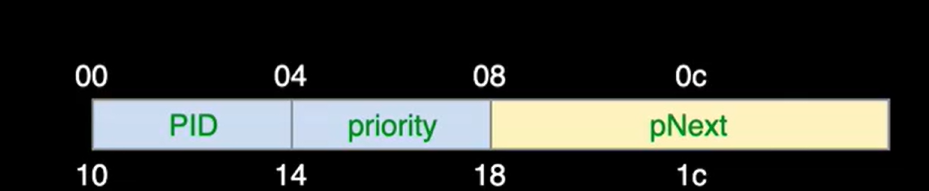
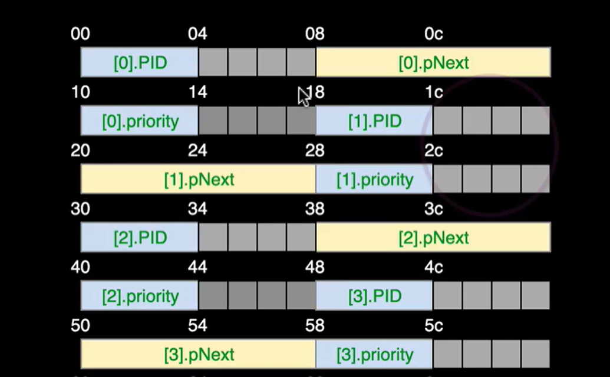

 # Recap

## Pointers 
* Pointers in C are variables that point to a specific memory address. They need to have a type eg `*int`

```C
int var_a = 5; // Declaring int a
int* var_b = &var_a; //Declaring int pointer b that points to the address of a
```

## C Structs
* Structures in C are collections of elements that are accessed by their names
```C
typedef struct LinkedListNode {
    int value;
    struct LinkedListNode* next;
} LinkedListNode
```

# Structures in Memory

* The elements in a struct are stored in memory in the order in which they were declared by default.
* This can lead to discrepencies in the size of structs in memory as the compiler tries to align elements in the struct based on the memory architecture of the system, 8 bytes in the case of 64 bit systems. 
* The compiler can be set to turn this optimization off to save memory space but it results in more memory reads being needed, thus is a tradeoff between space and time.

```C
typedef struct PCB_type {
    int PID; //ints take up 4 bytes (32 bits)
    int priority; // 4 bytes
    struct PCB_type* pNext; // 8 bytes (64 bit architecture)
    // The example involves the swapping of pNext and priority
}; PCB_type
```


* The struct is perfectly aligned in memory as the 2 integers fit nicely into 8 bytes (the amount of memory being read at once)


* There is internal fragmentation within the struct as the compiler ensures that each new item either starts or ends at a multiple of 8. 
* There is further fragmentation within the array between structs for the same reason.
* The compiler can pack consequtive array elements without wasted space but this would require more memory reads to read the array than if it was unpacked.

## Stack vs Heap
* When elements are created in C without using `malloc`, they are put on the stack (faster). 
* When elements are created using `malloc` they are put on the heap (slower).
* Elements on the stack can point to elements on the heap and vice versa.