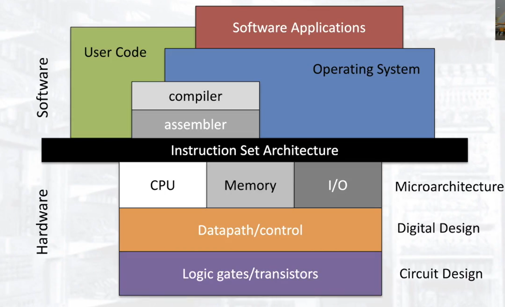

# ISA Design

The `Instruction Set Architecture` forms the bridge between software and hardware and has many design considerations based on the requirements of the design.

## Example Design Requirements

* Available Instructions
    * Types of data processing operations.
    * How is control flow handled?
    * How does data flow between the registers and main memory? 
* Addressing modes, supporting multiple gives more flexibility but requires more space in instructions
    * Absolute Addressing
    * Immediate Addressing
    * Indirect Addressing
    * Register Addressing
    * Register Indirect Addressing
    * Immediate Offset Addressing

## Factors that influence the ISA (Design Considerations)

### Number of Registers
* Width of registers.
* How many registers? More registers means more bits in the instruction to specify the register.
* Where is the PC?
* Which ones are visible to the user?

### Bus Size
* Address bus size
* Data bus size

### How Many Operations
* More operations means more bits to specify an operation.

### How many Operands per instruction
* More Operands needs a larger address bus.

### Where does the data live?
* Registers are faster but need more space on the chip which increases costs. More space will be needed in instructions to point to each register.

### RISC vs CISC
* CISC has a larger emphasis on hardware with variable instruction sizes, complex instructions that use multiple clock cycles and can access data held in memory.
* RISC only operates on data stored in local registers and generally only has single clock instructions
* Hence CISC tends to have more efficient memory use as compared to RISC.
* RISC Designs are easier to implement as they are less complex.