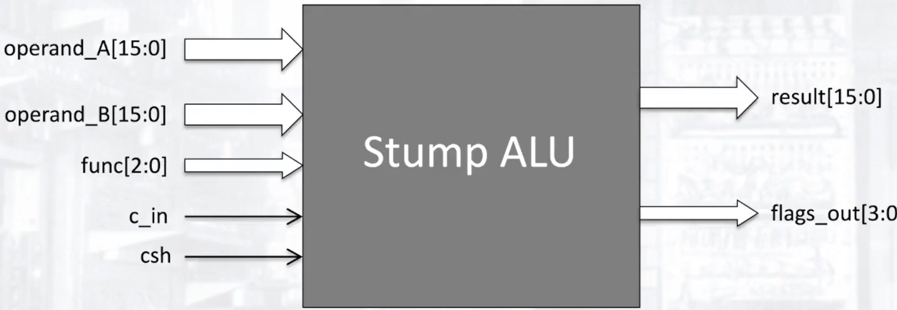

# Setting Flags in Stump

| Flag |               ADD/ADC               | SUB/SBC          | AND/OR           | LD/ST/BCC |
| ---- | :---------------------------------: | ---------------- | ---------------- | --------- |
| N    |            Check bit 15             | Check bit 15     | Check bit 15     | Never set |
| Z    |          Is the result 0?           | Is the result 0? | Is the result 0? | Never set |
| V    |                Refer                | Refer            | Always 0         | Never set |
| C    | Whether or not a carry is generated | Inverse of Carry | Use CSH          | Never set |

# Setting Overflows

## Checking Carries
* If the Carry of the MSB and the bit before it are different, an overflow has occurred.
* This is difficult to implement as the carry result for various arithmetic operations on each bit needs to be stored.

## Checking Sign based on the instruction and operand
* For `ADD`, if both operands are the same sign, then a change in the sign signifies that there is an overflow. There cannot be an overflow if the signs are opposite
* For `SUB`, if both operands are the same sign then a change in the sign signifies that there is an overflow. There cannot be an overflow if the signs are the same.