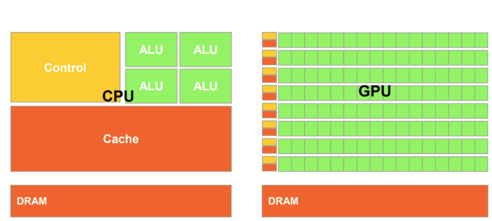

# Graphics Processing Units

* GPUs use parallel computing to benefit workloads that are:
    * Computationally intensive
    * Computations are independant
    * Computations are similar
* They have thousands of ALUs per processor. Much more of the GPU is allocated to ALUs and not much is dedicated to cache.
* They have many parallel execution units and more transistors however have lower clock counts.
* They have deeper pipelines than CPUs
* Have faster memory interfaces as data needs to be shifted around more.
* Hence they prioritise `throughput` over `latency`. This is why they do not need large caches as caches are used for lowering latency.
* GPUs have `task parallelism` while CPUs have `data parallelism`.
* CPUs have multi threaded cores while GPUs use Single Instruction Multiple Thread cores.

## Heterogeneous Systems
* heterogeneous systems are frameworks that make use of the best processor on the SoC for any given task.
* Frameworks like `OpenCL` exist to provide a means of coding heterogenous systems.