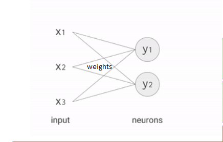

# Machine Learning

* Machine learning usually entails `adding` and `multiplying` scalar, vector and matrix objects.
* `Neural networks` operate by multiplying the input data with weights to represent signal strengths.
* At each neuron, the results are added into a single value and are then `activated` with an activation function.
* This process repeats down the chain of neurons.

## CPUs for Neural Networks
* The CPU doesn't know the next calculation until reading the next instruction from software, hence memory needs to be read at each step.
* The result of each calculation needs to be stored.
* Future steps are easily predictable and do not rely on each other and can be made parallel. The CPU cannot take advantage of this.
* Thus the throughput is limited as only 1 ALU is used and significant energy is used.

## GPUs for Neural Networks
* They have many ALUs that can work in parallel hence are much faster than CPUs for this task.
* However, they are slowed down and use a lot of energy as memory is constantly being written and read when passing data between the ALUs as GPUs are a general purpose architecture.
* Furthermore the footprint of the GPU is large because of this complex wiring.

## TPUs for Neural Networks
* TPUs are a `domain-specifc` architecture hence the multipliers and adders are connected to each other directly (`systolic array`), hence energy and size is saved as memory does not need to be accessed at each calculation and thus there is also no complex wiring.
* The TPU loads data from memory
* As each multiplication is executed, the result is directly passed to the next multiplier with the summation.
* Hence no memory is required at all during calculation.
* Thus the design is simple with minimal memory.