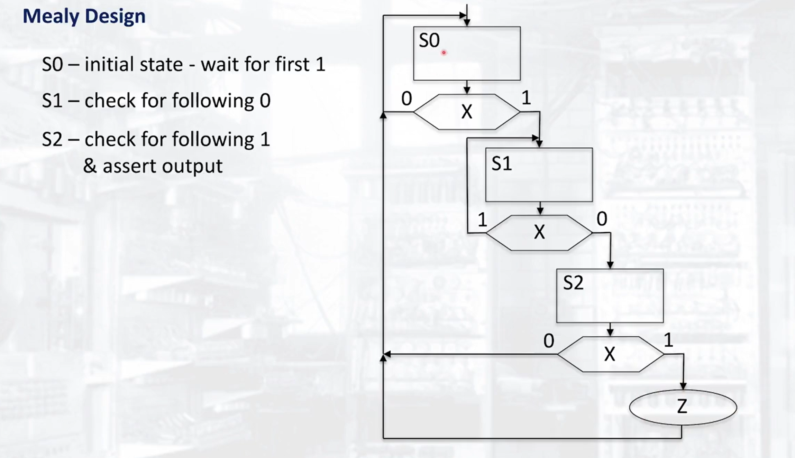

# Sequential Systems with no datapath

## Example Problem

Set the output `Z` high if the current stream of data is has had `101` as its previous 3 elements.

## Moore Design


```verilog
module sequence (input wire X, clk, rst, output reg Z);

reg [1:0] current_state, next_state;

//setting the next state logic
always @ (*)
    case (current_state)
        2'b00: if (X == 1) next_state = 2'b01;
               else        next_state = 2'b00;
        2'b01: if (X == 1) next_state = 2'b01;
               else        next_state = 2'b10;
        2'b10: if (X == 1) next_state = 2'b11;
               else        next_state = 2'b00;
        2'b11: next_state = 2'b00;
        default: next_state = 2'b00;
    endcase

// state assignment
always @ (posedge clk, posedge rst)
    if (rst)
        current_state <= 2'b00;
    else
        current_state <= next_state;

// output assignment
always @ (*)
    if(current_state == 2'b11)
        Z = 1;
    else
        Z = 0;

endmodule
```

## Mealy Design


```verilog
module sequence (input wire X, clk, rst, output reg Z);

reg [1:0] current_state, next_state;

//setting the next state logic (Same as moore with 1 less state)
always @ (*)
    case (current_state)
        2'b00: if (X == 1) next_state = 2'b01;
               else        next_state = 2'b00;
        2'b01: if (X == 1) next_state = 2'b01;
               else        next_state = 2'b10;
        default: next_state = 2'b00;
    endcase


// state assignment (Same as moore)
always @ (posedge clk, posedge rst)
    if (rst)
        current_state <= 2'b00;
    else
        current_state <= next_state;

// Setting the output based on current state and input
always @ (*)
    if ((current_state == 2'b10) && (X==1))
        Z = 1;
    else
        Z = 0; 
endmodule
```