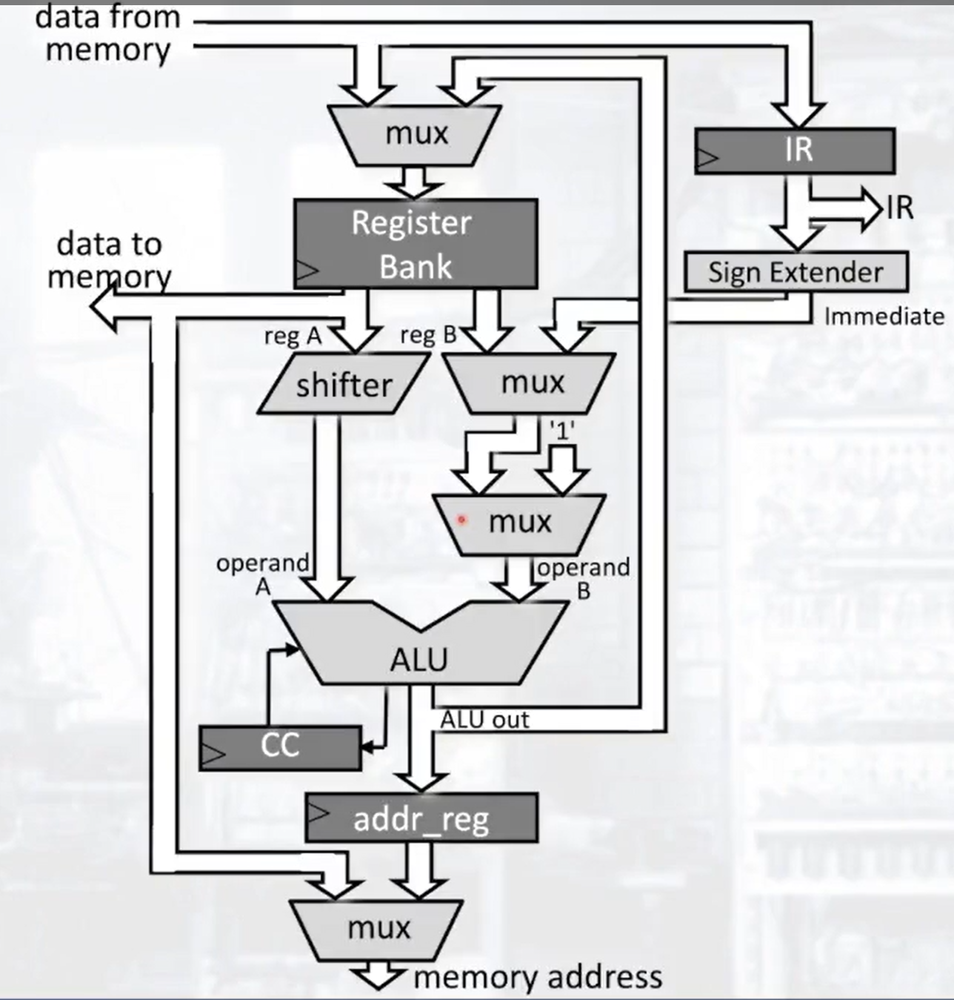

# Stump Control Logic

* The Stump FSM in the control block has 3 states:
    * Fetch
    * Execute
    * Memory Load/ Store

## Stump Control Signals

| Signal        | Definition                                                                                                        |
| ------------- | ----------------------------------------------------------------------------------------------------------------- |
| fetch         | is 1 when in the fetch phase                                                                                      |
| execute       | is 1 when in the execute phase                                                                                    |
| memory        | is 1 when in the memory load/store phase                                                                          |
| ext_op        | Sets the mode for amount of bits to extend based on if an instruction is type 2 or type 3                         |
| reg_write     | Determines if the selected register is written to from the signal passed to the mux (data in or ALU)              |
| dest[2:0]     | Determines the destination register in the register bank                                                          |
| srcA[2:0]     | Determines the register used for source A                                                                         |
| srcB[2:0]     | Determines the register used for source B                                                                         |
| shift_op[1:0] | Determines the amount of bits to shift                                                                            |
| op_B_mux_sel  | Selects if operand B to the ALU comes from the register bank or from the IR based on Type 2 or Type 3 instruction |
| alu_func[2:0] | Determines the function of the ALU (ADD/SUB/etc)                                                                  |
| cc_en         | Determines whether flags are set in the condition code registers                                                  |
| mem_rd        | Determines if a memory read operation is taking place                                                             |
| mem_wr        | Determines if a memory write operation is taking place                                                            |

## Fetch Control Signals

| Signal        | Set to | Reason                                      |
| ------------- | ------ | ------------------------------------------- |
| fetch         | 1      | We are in the fetch phase                   |
| execute       | 0      | We are not in the execute phase             |
| memory        | 0      | We are not in a memory load/store phase     |
| ext_op        | X      | Sign extender is not used in fetch          |
| reg_write     | 1      | PC is incremented                           |
| dest[2:0]     | 111    | We are writing to the PC                    |
| srcA[2:0]     | 111    | Initial value of the PC                     |
| srcB[2:0]     | X      | Not used as PC is incremented by 1          |
| shift_op[1:0] | 0      | No shifting is being done                   |
| op_B_mux_sel  | X      | Operand B is not used                       |
| alu_func[2:0] | 000    | Doing an addition                           |
| cc_en         | 0      | Condition codes are not set during fetch    |
| mem_rd        | 1      | Memory read during fetch                    |
| mem_wr        | 0      | Memory is not being written to during fetch |

## TODO: Add control signals for Execute and memory operations
