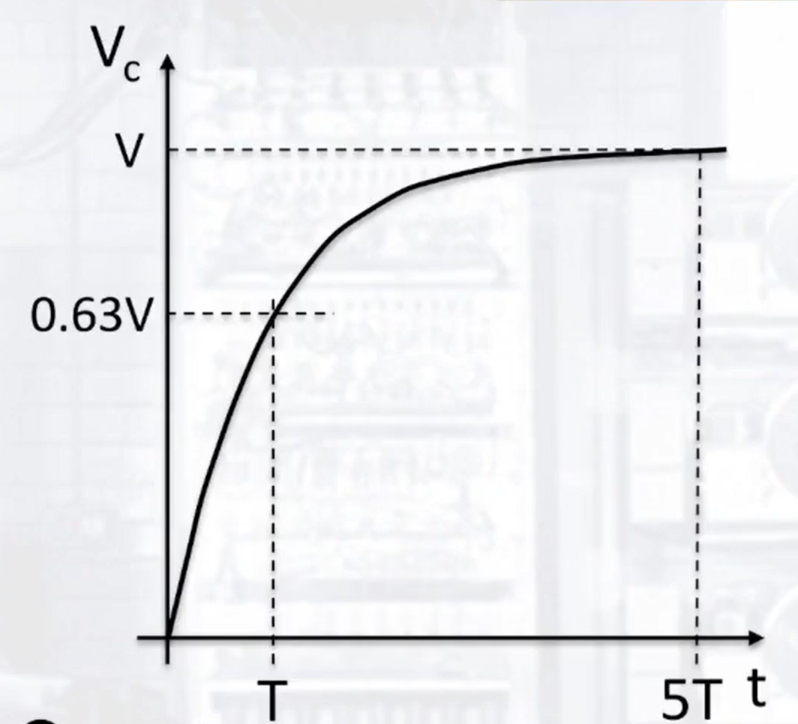

# Electricity

## Ohms Laws

* Voltage in parallel is equal for all of the branches as potential goes from high to low using the most efficient paths possible.
* In each branch, the drop in voltage is proportional to the amount of resistance encountered in the branch, from the initial voltage to 0.

| Concept | Series       | Parallel           |
| ------- | ------------ | ------------------ |
| V       | V1 + V2 + V3 | V1 = V2 = V3       |
| R       | R1 + R2 + R3 | 1/R1 + 1/R2 + 1/R3 |
| I       | I1 = I2 = I3 | I1 + I2 + I3       |

## Capacitance

* Voltage across capacitor increases over time until the maximum capacitance of the capacitor is reached.
    * Capacitance in series: 1/C = 1/C1 + 1/C2 + 1/C3
    * Capacitance in parallel: C = C1 + C2 + C3

### Capacitance Time

* The `Time Constant (T)` for a capacitor is the point where the `Voltage across the capacitor` is equal to `0.63*Voltage of the circuit`
* At `5T`, the voltage across the capacitor is `0.99*Voltage of the circuit`
* `T = Resistance * Capacitance`
