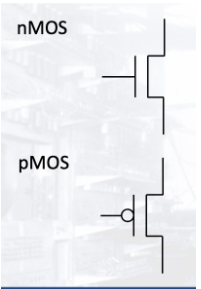
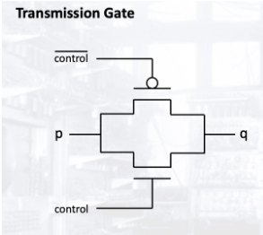
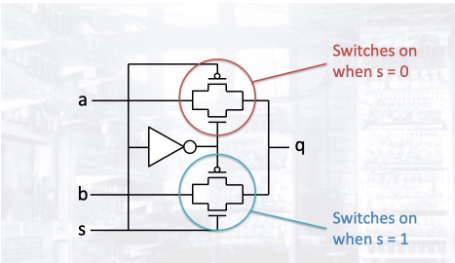

# MOS Transistors

* Transistors can be seen as switches where when a voltage is applied at the `Gate input`, current is able to flow between the `Drain` and the `Source`.
* In the case of `nMOS`, this is when the G is 1, 0 in the case of `pMOS`.

## MOS Transmission characteristics

* `nMOS` are bad at transmitting `1` and `pMOS` are bad at transmitting `0`, hence they need to work in tandem.
* Thus they can be connected in parallel to have the best of both worlds with a `transmission gate`.
* The `control` controls if the gate is on or not. (if the current at `p` flows to `q`).

## MUX using transmission gates

* `s` is used to select if `a` or `b` is sent to the output using a `NOT gate`.