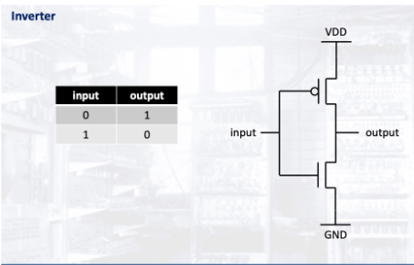
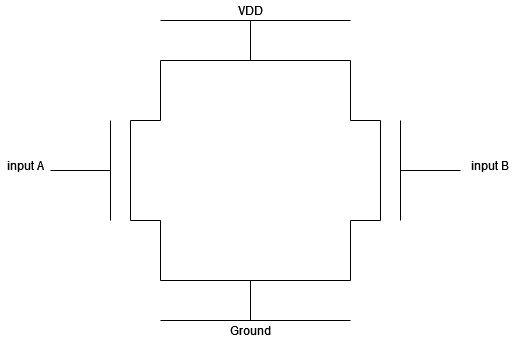
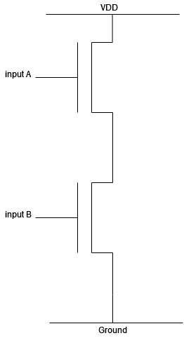

# CMOS

* As `nMOS` and `pMOS` have different transmission characteristics, `CMOS` uses them in a complementary fashion to ensure all states of a logic function are transmitted properly.
* They contain a `pull-up-network` made with `pMOS` that uses the power supply voltage to supply `1` when the logic function made with the pMOS returns `True`.
* The alternate is true for the `pull-down-network` made with `nMOS` and the ground.
* The `pull-up` and `pull-down` networks thus need to be opposite with the functions they return.

## CMOS network building blocks

### Inverter

* The inverter is made with a `pMOS` and `nMOS` in `parallel`. 

### Series and parallel transistor combinations
* `pMOS` and `nMOS` respectively can be placed in series or parallel to create logic.

### Parallel Configuration

### Series Configuration

|          | pMOS              | nMOS    |
| -------- | ----------------- | ------- |
| series   | NOT(A) AND NOT(B) | A AND B |
| parallel | NOT(A) OR NOT(B)  | A OR B  |