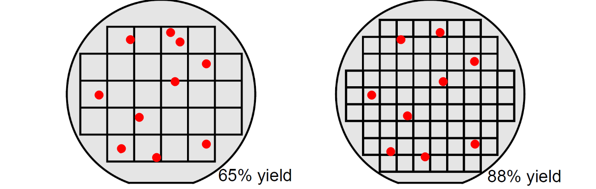

# Verification and Testing

## Verification
* Have you made what you have intended.
* Does it fulfill the requirements. 
* Does the particular part work. 
* VLSI Verification is done before silicon development to bug check the design.
* Encompasses digital and analogue simulation
    * Digital: verifies logic, reveals initialisation problems, no or approximate timing, faster.
    * Analogue: Verifies timing, reveals edge speeds, slow.

## Testing
* Done after the silicon is manufactured and is expensive.
* Checking the quality of the silicon that is actually manufactured eg checking for defects in individual chips.

# Software vs Hardware Simulation

## SOC Emulation
* SOC Emulation is used to emulate the design on either hardware or software.
* The entire design can be emulated for accuracy or some components can be black boxes to speed up the process.

## Hardware Simulation
* Hardware simulations are done on FPGAs that can synthesize large logic subsystems.
* This can provide access to signals that would otherwise be buried in the real chip for debugging purposes.
* Not as flexible as software simulation.
* Faster speed allows for more testing to be done as it saves development time and improves confidence that the chip will work.

## Comparison Table

| Hardware Simulation                 | Software Simulation                              |
| ----------------------------------- | ------------------------------------------------ |
| Faster                              | Slower                                           |
| More controllable                   | Less controllable, just runs                     |
| Better observability of all signals | Limited observality and may need logic analysers |
| Understands unknown nodes           | No concept of unknown                            |
| No timing model/ approximate        | Timing model will not be applicable to the ASIC  |
| Affordable                          | Very expensive                                   |

# Production Testing

* Chips are made on silicon wafers constituting of many chips. 
* Defects can occur on individual chips.
* The proportion of working chips in a batch is known as the yield and bigger chips have a tendency to provide lower yields as there are less chips per wafer, hence 1 fault can eliminate a larger proportion of the wafer.

## Testing in Production
* `Probe Testing`: Test the unpackaged chip to avoid wasting packaging costs, this requires time and specialised tooling. 
* `Package test`: Easier to perform, can be more wasteful but is necessary as the chip could have been damaged during packaging.
* `Wafer testing`: Specific tests on the wafer to check that the entire wafer does not have a systemic issue.

# Test Coverage
* Refers to the proportion of the design that is tested.
* `Design-Time`: Testing at the RTL level to test the source code and all its routes. 
* `Circuit Level`: Testing the circuit from the HDL description
* `Production`: Testing the chips themselves for broken components or bridges, not the design.

# Design for Test
* There are 2 main components to designing a system that can be tested easily.

## Observability
* Being able to see the outputs of the Device under Test.
* Done by bringing to a test port.

## Controllability
* Making it easier to inject test patterns in each specific locality.
* This is hard if the circuit is deeply buried.
* A multiplexer can be embedded in front of the block with a switch to take patterns from a programmable source.