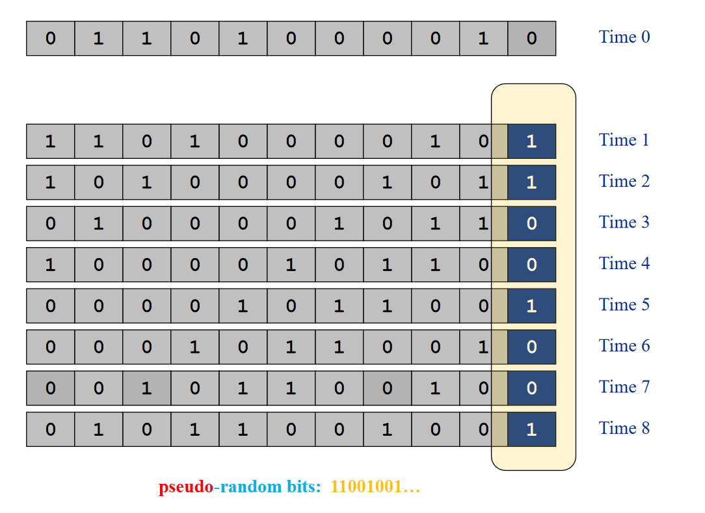

# Linear Feedback Shift Registers

* They are used to generate pseudo random sequences.
* Given a certain input, they will always generate the same `(2^N)-1` outputs.
* This is useful for creating test data as all the patterns do not need to be stored in a ROM that can be corrupted. Furthermore, the `LFSR` circuit is smaller and simpler than storing test patterns.

## LFSR Operation

* Get an input seed of N bits.
* get the XOR result of the first and third bit of the sequence.
* Shift the sequence to the left once, the new rightmost bit becomes the afforementioned XOR'd result.
* Do this N times to get a psuedorandom sequence that is a combination of the rightmost bit at each iteration.

## Using LFSRs for Built in Self Tests 
* Consider using an FPGA to test possible positions of a module on a chip.
    * Different locations can be better or worse due to process variations during manufacturing.
* Built in self-tests can be then done to test each location and find the best location.
* It is done by using the LFSR to generate a test pattern and a CRC checksum to compress outputs from a module under test.
* For each location, consider the checksum to compare the locations.

## Advantages of BIST
* Can be used for overclocking by testing the highest operating frequency in different locations in the FPGA
* Can be used for redundancy wherein a chip can leave different resources unused when using different paths. Thus if one path doesn't work due to a specific area on a chip, a different path can be used. Testing the paths can be done with `BIST`.