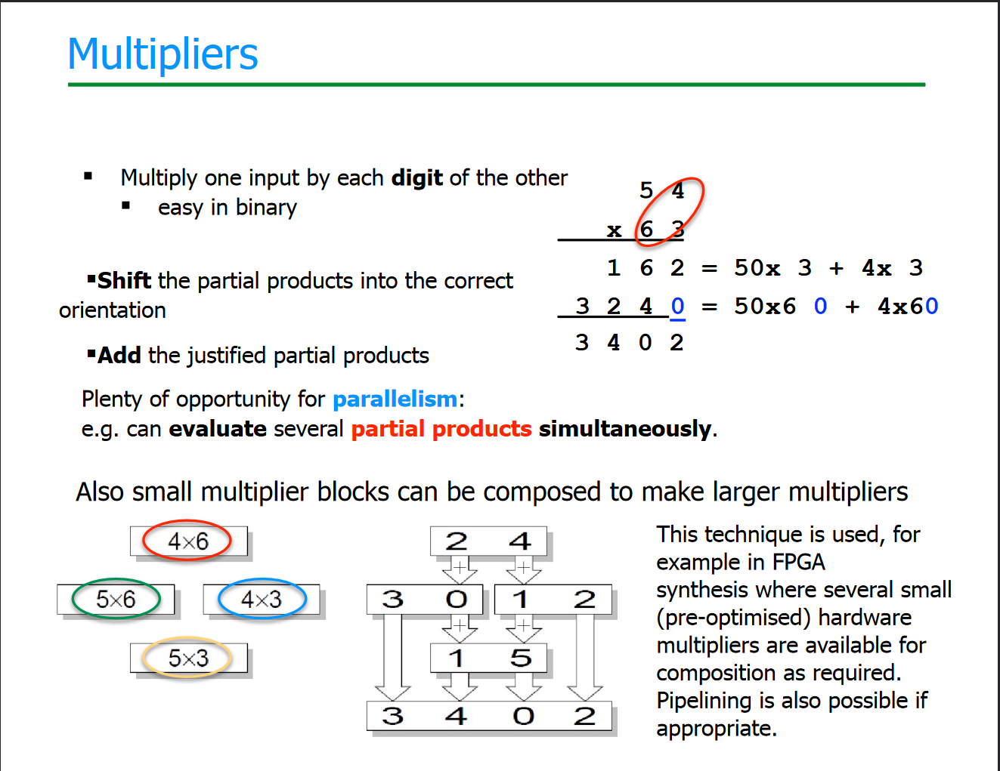

# Binary Multipliers

* Binary multipliers involve computing a set of partial products and summing after shifting them hence there is a lot of potential for parallelism.
* Furthermore smaller multiplier blocks can be composed to make larger multipliers.
* Multi operand adders are better for multiplication hence a `carry save adder` is preferred. `Tree carry ripple` adders can also be used but are slower.