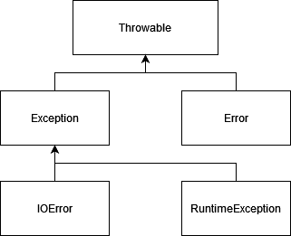

# Exceptions and errors



* There are 2 types of throwables, exceptions and errors. Errors are for errors that programs should not aim to handle like operating system errors. 

## Checked vs Unchecked

* Exceptions can be checked and unchecked
* Checked exceptions inherit from Exception and any code inheriting a class that can throw a checked exception must handle the exception.
* Unchecked exceptions inherit from RuntimeException and it is not mandatory to handle them.

## Checked exception example

```java
public void ExampleClass() throws FileNotFoundException {
    //Code that throws exception here
}
// Using the code
try {
    ExampleClass example = new ExampleClass();
} catch (FileNotFoundException e) {
    // Handle the exception
} finally {
    // Code here is run regardless of try and catch
}
```

# FileIO

3 Types of files: 
* Text- A human readable file usually encoded in ASCII or UTF-8 encoding
* Binary- Represent encodings that are not human readable like executables. They are more efficient.
* Object Serialisation- A special type of binary encoding that can be used by java to store objects into files that can be read into objects at a later time

## Serialisation
* Any classes that can be serialised must implement the `Serializable` interface. 
* Methods can have the `transient` keyword attached to them to ensure they are not part of the serialized data and can be used for private data or for derived fields.

Serilization example
```java
public class SerializedThing implements Serializable {
    static String thing = "regular field";
    transient int secret = 5;
}

SerializedThing thing = new SerializedThing();

// Writing to a file
ObjectOutputStream objectOutput = new ObjectOutputStream(new FileOutputStream("filename.txt"));
objectOutput.writeObject(hting);
objectOutput.flush();
objectOutput.close();

// Reading from a file
ObjectInputStream objectInput = new ObjectInputStream(new FileInputStream("filename.txt"));
SerializedThing thing = objectInput.readObject();
objectInput.close();
``` 

As shown above, all input files must be inputted with a `FileInputStream` / `FileOutputStream` before being passed to: 
* `ObjectInputStream` for serialized data.
* `DataInputStream` for binary data.
* `BufferedReader` or `PrintWriter` for text data.