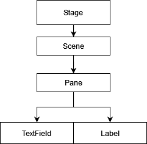

# JavaFX

## JavaFX Hierarchy


* Stage refers to the application window itself. 
* A scene is a view in the application and the current active scene can be switched around in the stage. (Like a page)
* Panes like `VBox` and `AnchorPane` are containers that can contain many elements like `TextFields`. Different panes have different layouts for the elements within them.

## Instantiating the JavaFX GUI
``` java
import javafx.application.Application;
import javafx.stage.Stage;


public class Main extends Application {
    // A start method is required
    @Override
    public void start(Stage stage) {
        stage.show();
    }

    // Main to launch the GUI
    public static void main(String[] args) {
        launch(args);
    }
}
```

## Example JavaFX code
```java
public class House extends Application {
    @Override
    public void start(Stage stage) {
        // Creating Elements to add to the Pane
        Rectangle element = new Rectangle(0,0, 500, 500);
        element.setFill(Color.BLUE);

        //Creating a Pane that contains the element
        AnchorPane root = new AnchorPane();
        root.getChildren().add(element); 

        //Creating a scene that contains the Pane
        Scene scene = new Scene(root);

        //Setting the current Scene on the stage
        stage.setScene(scene);
        stage.show();   
    }
}
```

## Handler Events

* Events can be called by actions performed on elements in the GUI. 
* Binding a function to an event makes the bound function run every time the event occurs.
```java
    // OnClick event using lambda function.
    element.setOnMouseClicked(e -> {
        System.out.println("Clicked me");
    });

```