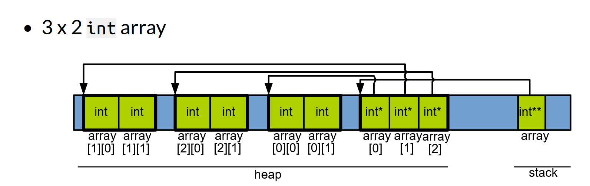

# Dynamic Memory Allocation

* Static memory allocation as well as variable sized arrays (`int my_arr[variable]`) are stored in the stack.
* This can lead to problems as the size of the stack is very small.
* Hence dynamic memory allocation needs to be done to store elements in the heap.

## Allocating on the Heap
```C
int main(int argc, char **argv) {
    int size = atoi(argv[1]); // gets the size of the array from argv.

    int *heap_array;
    heap_array = malloc(size*sizeof(int)); // Creating the array in heap
    free(heap_array); // Freeing the memory once it is done being used
}
```

## Allocating 2D arrays on the Heap
* non-contiguous multidimensional arrays on the heap can be allocated by allocating a pointer that points to an array of pointers which themselves point to their individual arrays.


```C
int a = 3;
int b = 2;
int **array

array = malloc(a* sizeof(int*));
for (int i=0; i<a; i++) {
    array[i] = malloc(b* sizeof(int));
}

array[2][0] = 12; // Assigning variables in the array

// Freeing the memory
for (int i=0; i<a; i++) {
    free(array[i]);
}
free(array);
```
* Contiguous multidimensional arrays can be allocated as such:
```C
int (*arr)[b] = malloc(a * sizeof(*array));
```