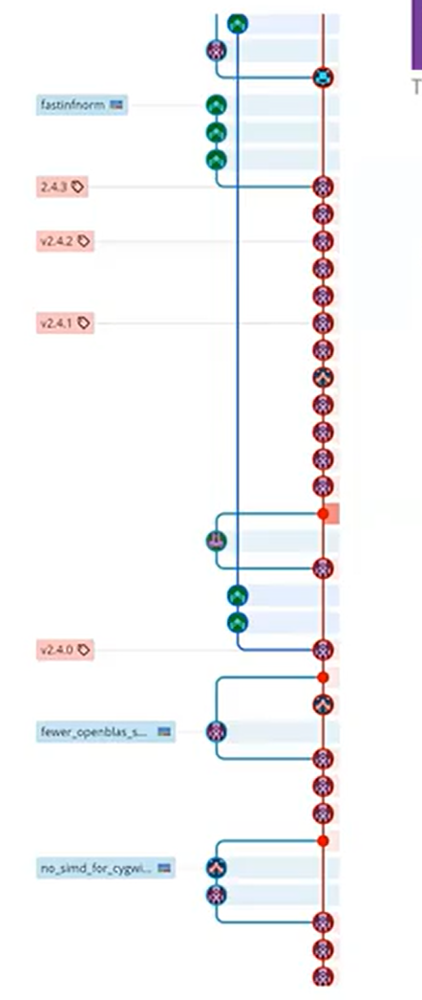
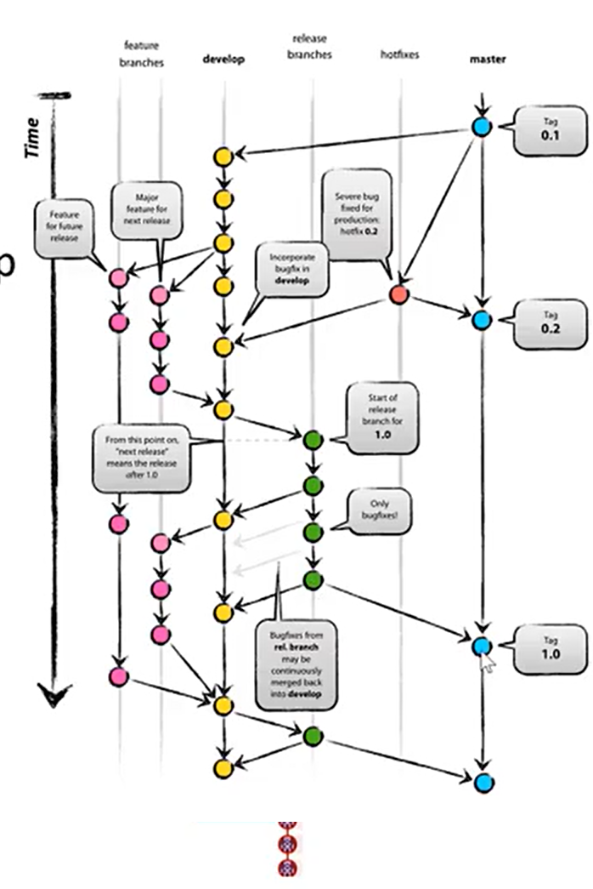

# Commit Messages

## Commit Messages good practices
* First line :
    * should be imperative
    * not more than 50 characters.
* Blank line between first line and the summary after it:
    * Lines should not be more than 72 characters.
    * Should have a detailed description of the change
* Should end with bug tracking intergration information and resources.

# Git Workflows

## Repositoy Setups
* `Cluster of Clones`: One central repository with every developer having their own local git cloned repository. If an individual developer messes up their local branch, they can clone from the remote.
* `Cluster of Forks`: One central repository that is forked by each developer. Each developer then has their own local git cloned repository of their individual fork. Allows for CI/CD to be run on their forks.
* `Dictators and lieutenants`: One central owner of the project that works on a clone of the main repository. Many lieutenants fork the central repository and manage developers who have forked the lieutenants fork which they then clone and work on their local machines.

## Lines of Development
* `Main`: The latest stable release of the code
* `Integration`: Integration of new changes prior to preparation for release
* `Release`: Versions of the code that are being prepared for release
* `Validation`: Versions of code awaiting QA
* `Change`: Implementation of changes to features/additions of features
* `Fix`: Implementation of corrections to code behaviour

## Types of Git Workflows

### Feature Branches

* 2 or 3 lines of development:
    * `main and intergration` 
    * `change and fix`
    * `release`
* Uses merge for change/fix branch integration. If code reviews are used, then Pull Requests are used instead.
* Uses rebase for syncing local with remote.

### GitFlow

* Has several layers of protection for team development
* Lines of development:
    * `master`: One long lived master branch
    * `Integration`: One long-lived branch called develop
    * `Changes and fixes`: Branches off integration and does non fast forward merges into integration.
    * `Hotfixes`: Branches off main and merges into main and integration
    * `Releases`: Short lived, branches off integration and merges into main and integration.

### Github Flow
* Only 1 long lived branch used for both intergration and releases.
* Assumes a `cluster of forks` repository configuration.
* Every commit to main must be deployable.
* Code reviews are done through pull requests.
* Change branches must be tested in production before merging.

### Trunk Based Development
* One long lived branch called the `trunk`. 
* Only clean code can be on the trunk as the trunk is immediately deployed.
* Not for beginners.
* Changes are done on local master.